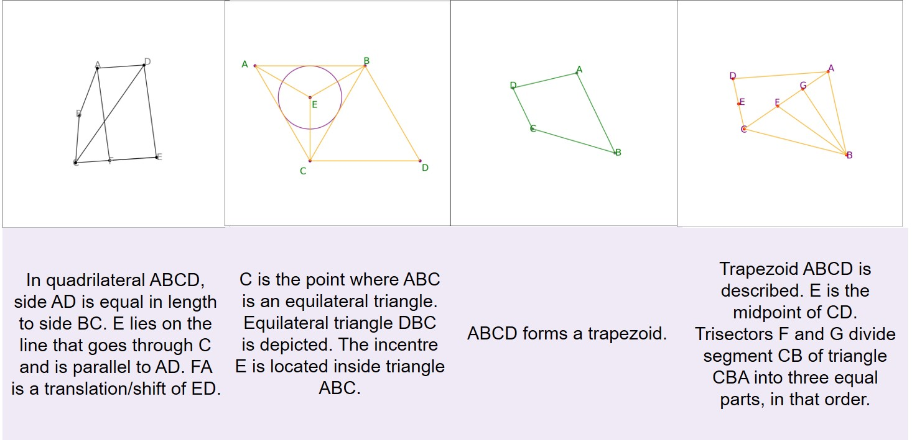
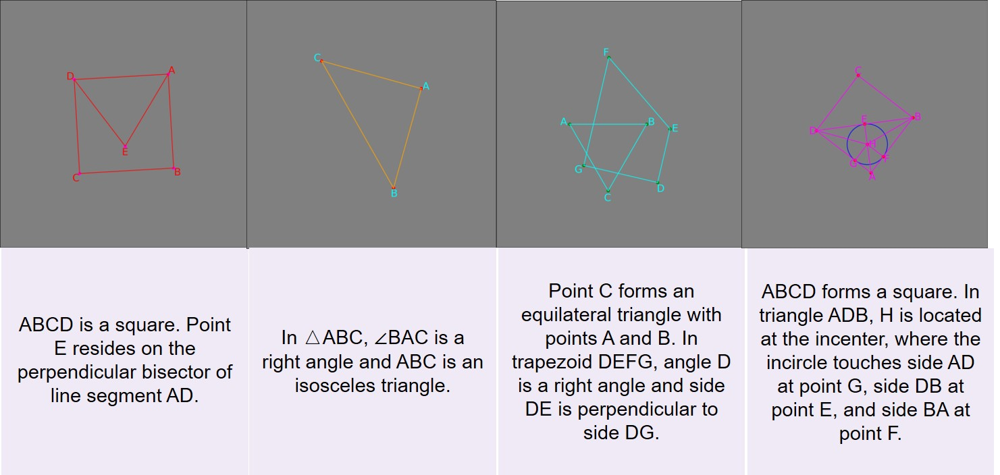
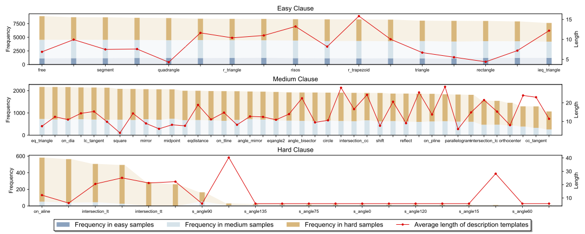

#  AutoGeo: Automating Geometric Image Dataset Creation for Enhanced Geometry Understanding

* An Automatic Geometry Data Synthesis Tool *

# Environment
You can install the environment with this:
```
conda env create -f llava.yml
```

## Data Generation
To generate data, you can run:
```
cd data
python generate_datasets_multiprocess-reinforce.py
```

After downloading or runing data synthesis script, the organization of data in `./data` are expected to be as following

```
└── AutoGeo
    ├── dataset_reinforce_100k
    │   ├── img
    |   └── data.json
    └── dataset_test
        ├── img
        └── data.json
```

## Quick Start With AutoGeo

<details>
<summary>Example Code (you can run it in ./data/demo.py)</summary>

```Python
import sys
import os
from utils.loading_utils import load_definitions_and_rules
import graph as gh
import problem as pr
from clause_generation import * #CompoundClauseGen
import signal
from pretty_problem_statement_dict import * # 改为经过语料扩展的结果
import json
from data_augmentation.opencv import *
import shutil
sys.path.append('..')
signal.signal(signal.SIGALRM, signal_handler)
data_desc=[]

save_dir='./demo'
defs_path = './defs.txt'
rules_path = './rules.txt'
complexity = 1 # set complexity

cc_gen = CompoundClauseGen(definitions, complexity)

# Automatic clause select
txt = cc_gen.generate_clauses()
# Manual clause select
# txt = "A B C = triangle A B C"

p = pr.Problem.from_txt(txt)

# Load definitions and rules
definitions, rules = load_definitions_and_rules(defs_path, rules_path)

try:
    # Set an alarm for 5 seconds
    signal.alarm(5)
    # Code block to execute with timeout
    g, _ = gh.Graph.build_problem(p, definitions)

    # Additionaly draw this generated problem
    gh.nm.draw_reinforce(
        g.type2nodes[gh.Point],
        g.type2nodes[gh.Line],
        g.type2nodes[gh.Circle],
        g.type2nodes[gh.Segment],
        theme='',
        save_to=save_dir+f"/img/demo.jpg")

    data_desc.append(
        {
        "id": f"demo",
        "image": f"img/demo.jpg",
        "conversations": [
            {
                "from": "human",
                "value": "Render a clear and concise description of a image about geometric shapes.\n<image>"
            },
            {
                "from": "gpt",
                "value": gen_nl(txt)
            }
        ],
        "clause": [remove_uppercase_space(clause_item) for clause_item in txt.split(";")]
    }
    )
        
    signal.alarm(0)
except KeyboardInterrupt:
    sys.exit(0)
except:
    print('err occurred, retrying ...')
    sys.exit(0)

json_data = json.dumps(data_desc, indent=2)
with open(f"{save_dir}/data.json", "w") as file:
    file.write(json_data)

```
</details>

## Data Synthesis Examples

### Examples



### Briefs about AutoGeo-100k


## Model Geometry Caption
After you generate data, you can pretrain model on the synthesized geometry captioning data by runing the following script:
```
./scripts/v1_5/gc.sh
```
This script will tune the model and then evaluate the performance.

| Hyperparameter | Global Batch Size | Learning rate | Epochs | Max length | Weight decay |
| --- | ---: | ---: | ---: | ---: | ---: |
| LLaVA-v1.5-7B | 64*8 | 6e-5 | 2 | 512 | 0 |

| Model Setting| ViT | Projector | Language Module |
| --- | ---: | ---: |
| LLaVA-v1.5-7B | Lora with lora r = 128 and lora alpha = 256 | Tunable | Frozen |
<!-- | --- | ---: | ---: |
| LLaVA-v1.5-13B | Lora with lora r = 128 and lora alpha = 256 | Tunable | Frozen |
| --- | ---: | ---: |
| MiniGPT4 | Lora with lora r = 64 and lora alpha = 16 | Tunable | Frozen | -->


## Model Geometry Questioning and Answering
After you tuned model on the synthesized data, you can further tune the model on QA data by runing:
```
./scripts/v1_5/gqa.sh
```

